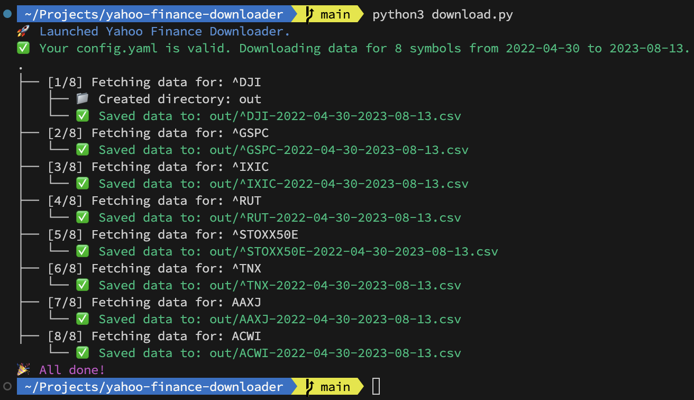

# Yahoo Finance Downloader

A simple script to download historical data from Yahoo Finance.
See the comments in config.yaml for more information.



## Installation instructions for non-programmers

1. Ensure you have Python 3.6 or newer installed.
2. Clone this repository or download the zip file and extract it.
3. Install the dependencies in a command prompt (see below).
4. Run the script by double-clicking on `download.py` or by typing `python download.py` in a command prompt. Make sure that you configured `config.yaml` correctly.

## Install dependencies

```bash
pip install yfinance pydantic pyyaml tqdm termcolor
```
